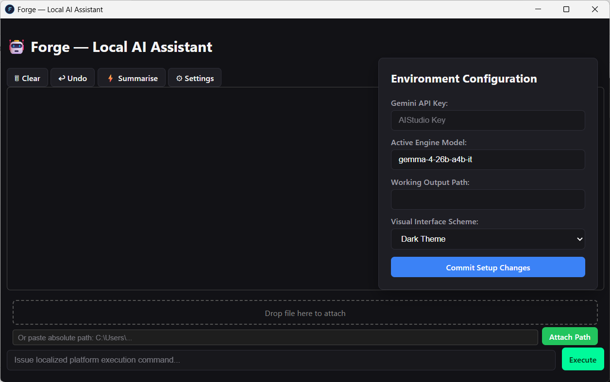
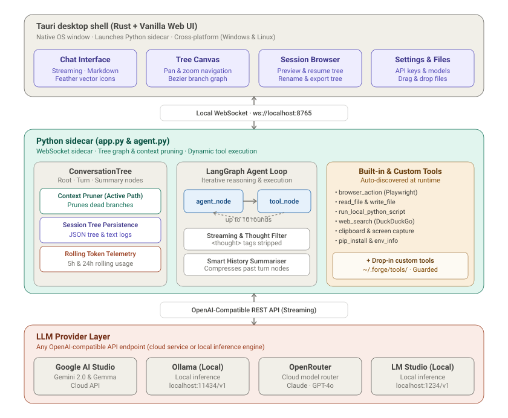

# Forge — Local AI Assistant

> A fully local, tool-using AI agent that runs on your machine. Drop in custom Python tools, connect any OpenAI-compatible LLM (cloud or local), and let it browse the web, read files, run scripts, and take screenshots — all from a native desktop UI.



---

## What is Forge?

Forge is a desktop AI agent built around the idea that your AI should work *on your machine*, not just *for* you in a browser tab. It connects any OpenAI-compatible model — including locally-run Gemma, Llama, Mistral, or cloud APIs like Google AI Studio — to a set of real, executable tools: file I/O, browser automation, Python script execution, clipboard access, screenshots, and more.

You extend it by dropping a single Python file into a folder. No configuration, no registration, no recompilation. The agent picks it up on the next run.

The UI is a Tauri desktop app (Rust shell + web frontend). The backend is a Python WebSocket sidecar running LangGraph. The two talk over a local WebSocket at `ws://localhost:8765`.

---

## Architecture



*The frontend communicates with the Python backend exclusively over a local WebSocket — no HTTP server, no REST API, no external relay.*

---

## Features

- **Tool-using agent** — LangGraph-powered reasoning loop that calls real local tools, not simulated ones
- **Streaming responses** — tokens stream in real time; internal thought blocks are stripped before display
- **Browser automation** — Playwright-based browser tool that opens a real Chrome window and navigates, searches, fills forms, extracts content, and downloads files
- **File I/O** — read and write files on your local filesystem, with path protection (see Guardrails)
- **Script execution** — run Python scripts locally; stdout/stderr is returned to the agent
- **Clipboard access** — read from and write to the system clipboard
- **Screenshot capture** — take screenshots of your screen and pass them to the agent
- **Drag-and-drop file attachment** — drag any file onto the UI to attach its path to the session
- **Absolute path attachment** — paste a file path directly to register it without copying the file
- **History management** — clear, undo (last turn), or summarise history to compress token usage
- **Session persistence** — every session is saved to `~/.myagent/agent_sessions/` as a timestamped `.txt` file including start time, end time, duration, and total token count
- **Dual history system** — active history (passed to LLM, can be cleared/undone/summarised) is kept separate from the permanent session log (append-only, never modified)
- **Settings UI** — change API key, model, working directory, and theme without touching config files
- **Theme support** — dark and light mode
- **Graceful shutdown** — closing the window saves the session and terminates the Python sidecar automatically
- **Custom tools** — extend the agent with your own Python tools, no rebuild required

---

## Getting started

There are two ways to use Forge: install the pre-built MSI (end users), or run from source (developers).

### Option A — Install the MSI (end users, zero dependencies)

1. Download the latest `Forge_x.x.x_x64_en-US.msi` from the [Releases](../../releases) page
2. Run the installer — no Python, Node, or Rust required
3. Launch **Forge** from the Start Menu
4. Open **Settings** (⚙ button, top right), enter your API key, and click **Commit Setup Changes**

On first launch, Forge will automatically download the Chromium browser in the background for the `browser_action` tool. This is a one-time download into `~/.myagent/playwright-browsers/`.

### Option B — Run from source (developers)

**Requirements:** Python 3.11+, Node.js 18+, Rust (stable), Google Chrome

**First time only:**

```cmd
git clone https://github.com/harshgupta-23/Forge.git
cd forge
setup.bat
```

`setup.bat` creates the venv, installs all Python and Node dependencies, installs Playwright browsers, and copies `config.template.json` → `config.json`. Then open Settings in the app and enter your API key and your preferred output directory for agent-created files.

**Every time after that:**

```cmd
start.bat
```

`start.bat` starts the Python backend in a separate terminal, waits 3 seconds, then launches the Tauri UI.

---

## Building the MSI installer (developers)

**Requirements:** Python 3.11+, Node.js 18+, Rust (stable), internet connection

Run from the project root:

```powershell
powershell -ExecutionPolicy Bypass -File build_installer.ps1
```

The script will:
1. Download the embeddable Python 3.11.9 runtime
2. Bootstrap pip and install all dependencies from `requirements-embed.txt` into the embedded interpreter
3. Copy the backend source into `src-tauri/resources/`
4. Run `tauri build --bundles msi`

The finished `.msi` is output to `src-tauri/target/release/bundle/msi/`.

> `src-tauri/resources/` is a build artifact — it is gitignored and must never be committed.

---

## Setup

1. Open **Settings** (⚙ button, top right)
2. Enter your **API key** — Google AI Studio keys work out of the box (`AIzaSy...`)
3. Set the **model** — default is `gemma-4-27b-it`; use any model string your provider supports
4. Set your **output directory** — where the agent saves files it creates
5. Click **Commit Setup Changes**

Your config is saved to `~/.myagent/config.json` — never inside the source tree.

### Supported API providers

Any OpenAI-compatible endpoint works:

| Provider | Base URL |
|---|---|
| Google AI Studio | `https://generativelanguage.googleapis.com/v1beta/openai/` |
| Ollama (local) | `http://localhost:11434/v1` |
| OpenRouter | `https://openrouter.ai/api/v1` |
| LM Studio | `http://localhost:1234/v1` |

---

## Built-in tools

| Tool | What it does |
|---|---|
| `web_search` | Searches the web and returns results |
| `browser_action` | Full browser automation via Playwright — navigate, search, fill forms, extract content, download files |
| `read_file` | Reads a file from disk and returns its contents |
| `write_file` | Writes content to a file on disk |
| `run_local_python_script` | Executes a Python script locally and returns stdout/stderr |
| `take_screenshot` | Captures a screenshot and saves it to the working directory |
| `read_clipboard` | Reads the current clipboard contents |
| `write_clipboard` | Writes text to the clipboard |
| `list_directory` | Lists files and folders in a directory |
| `copy_file` | Copies a file from one path to another |
| `pip_install` | Installs a Python package into system Python at runtime |
| `get_environment_info` | Returns system info — OS, Python version, environment variables |

---

## Adding custom tools

This is the core design principle of Forge: **any Python file dropped into the tools folder becomes an agent tool automatically.**

Drop your tool into `python_backend/tools/`:

```python
# python_backend/tools/my_tool.py
from langchain_core.tools import tool

@tool
def my_tool(input: str) -> str:
    """
    One-sentence description of what this tool does.
    The agent uses this docstring to decide when to call the tool.
    """
    return "result"
```

Restart Forge and the tool is live. No other changes needed anywhere.

You can also drop tools into `~/.myagent/tools/` — these are loaded at runtime and kept separate from the source tree. This works in both the dev setup and the MSI install.

### Rules for custom tools

- The `@tool`-decorated function must have the **same name as the file** (without `.py`)
- The **docstring is critical** — the LLM reads it to decide when to use the tool. Be specific and concrete
- Return a **string** — the agent receives the return value as text in its context
- You can import anything available in the Python environment
- Tools can call external APIs, run subprocesses, interact with the OS, or anything else Python can do

### Example: a currency converter tool

```python
# tools/convert_currency.py
import urllib.request
import json
from langchain_core.tools import tool

@tool
def convert_currency(query: str) -> str:
    """
    Converts an amount from one currency to another.
    Input format: '100 USD to INR'
    """
    ...
    return f"{amount} {from_cur} = {result:.2f} {to_cur}"
```

---

## Guardrails

Forge runs with direct access to your local machine. Three built-in tools — `read_file`, `write_file`, and `run_local_python_script` — check every path against a protection list before executing:

```python
def is_path_protected(file_path: str) -> bool:
    """Returns True if the path targets config.json, a dot-env file, or the backend folder."""
    target_path = Path(file_path).resolve()
    backend_dir = Path(__file__).parent.parent.resolve()

    if target_path.name.lower() in ("config.json", ".env"):
        return True
    if backend_dir in target_path.parents or target_path == backend_dir:
        return True
    return False
```

This prevents the agent from reading or writing your API key (`config.json`), any `.env` file, or any file inside the `python_backend/` source directory — even if instructed to do so by a prompt injection or a malicious webpage visited via `browser_action`. Attempts to access protected paths are blocked and the agent is told the path is unavailable.

Your API key is stored only in `~/.myagent/config.json` and is never sent anywhere except your chosen LLM provider.

---

## What gets committed to git

| Path | Committed | Reason |
|---|---|---|
| `src/` | ✅ | Frontend HTML/JS/CSS |
| `src-tauri/src/` | ✅ | Rust source |
| `src-tauri/tauri.conf.json` | ✅ | Tauri config |
| `python_backend/agent.py` | ✅ | Core agent |
| `python_backend/app.py` | ✅ | WebSocket sidecar |
| `python_backend/tools/` | ✅ | Built-in tools |
| `python_backend/requirements.txt` | ✅ | Dev dependencies |
| `python_backend/requirements-embed.txt` | ✅ | MSI build dependencies |
| `config.template.json` | ✅ | Safe default config |
| `build_installer.ps1` | ✅ | MSI build script |
| `start.bat` | ✅ | Dev launcher |
| `setup.bat` | ✅ | First-time dev setup |
| `config.json` | ❌ | Contains your API key |
| `python_backend/.venv/` | ❌ | Virtual environment |
| `python_backend/chrome_profile/` | ❌ | Browser session data |
| `node_modules/` | ❌ | npm packages |
| `src-tauri/target/` | ❌ | Rust build output |
| `src-tauri/resources/` | ❌ | Generated by build_installer.ps1 |

---

## Current limitations

- **No session browser** — sessions are saved as `.txt` files but there is no in-app UI to browse, search, or resume a previous session. This is planned.
- **Python scripts only** — `run_local_python_script` runs Python only. PowerShell or Bash tasks need either a Python `subprocess` wrapper or a dedicated custom tool.
- **No branching history** — history is linear (clear, undo one turn, summarise). There is no checkpoint system to branch from a mid-conversation state or fully restore an earlier point if a long tool chain fails deep into execution.
- **Single user, local only** — the WebSocket sidecar runs on localhost and is designed for one active session at a time.

---

## License

[Apache License 2.0](LICENSE)
